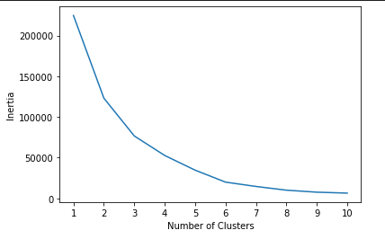

# Cryptocurrency-Clusters

## Background

* Through unsupervised machine learning analyze and report on what cryptocurrencies are on the trading market and determine whether they can be grouped to create a classification system using a dataset from [CryptoCompare](https://min-api.cryptocompare.com/data/all/coinlist).

## Process

### Data Preparation: 

* Exclude cryptocurrency that is not being traded, or has not been mined. 
* Convert text values to numerical data and standardize the dataset.

### Dimensionality Reduction: 
* Reduced number of features through PCA and t-SNE, preserving 90% of the explained variance in dimensionality reduction.

### Cluster Analysis with K-Means:
* Create an elbow plot to determine the best number of clusters.

## Findings and Recommendations

* After preparing the data I found 532 tradable cryptocurrencies.
* Looking at the elbow plot it looks like the best number of groups to classify is 5, possibly 6.

* Looking at the scatter plot it there are 3 main clusters. There are a couple in the middle that looks like only 1 or 2 data points.

## References

Crypto Coin Comparison Ltd. (2020) Coin market capitalization lists of crypto currencies and prices. Retrieved from [https://www.cryptocompare.com/coins/list/all/USD/1](https://www.cryptocompare.com/coins/list/all/USD/1)

- - -

